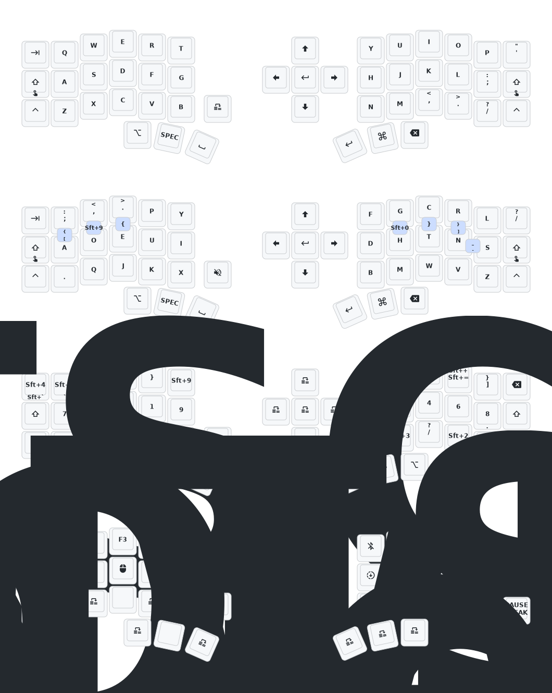

- [中文](README.md)
- [English](README_EN.md)

# 睫毛外设 (Eyelash Peripherals) Corne ZMK 仓库

**该键盘与 [foostan's Corne](https://github.com/foostan/crkbd) 不同，无法与标准的 `corne` 固件兼容。**


如果您需要该键盘的 3D 模型，请发送电子邮件至 `380465425@qq.com`。

## 使用说明

1. [叉取此仓库](https://docs.github.com/en/get-started/quickstart/fork-a-repo#forking-a-repository)。
2. [点击 **Actions** 选项卡，确保工作流已启用](https://docs.github.com/en/actions/managing-workflow-runs-and-deployments/managing-workflow-runs/disabling-and-enabling-a-workflow#enabling-a-workflow)。
3. 确保 [`config/west.yml`](config/west.yml) 中的 `eyelash_corne` 项目仍然有效。`boards/arm/eyelash_corne` 文件夹将从此 URL 下载。
4. 如果您的叉取中仍存在 `boards/arm/eyelash_corne` 文件夹，请将其删除。

**如果您已经有 ZMK 配置仓库，[您可以将此作为模块添加，而不是叉取](https://zmk.dev/docs/features/modules#building-with-modules)。**

## Corne 键位图



## My setup

### Layers

- **Layer 0 (QWERTY)** — used with macOS Russian input source
- **Layer 1 (DVP)** — Dvorak Programmer, used with macOS ABC input source
- **Layer 2 (SPEC)** — numbers and symbols, accessed via `MO(2)`
- **Layer 3 (BTWN)** — F-keys, mouse, bluetooth, bootloader, accessed via `TO(3)` from SPEC layer

### Input source switching

ZMK macros send `Hyper+1` (Ctrl+Shift+Alt+Cmd+1) and `Hyper+2` (Ctrl+Shift+Alt+Cmd+2) when switching layers. The host OS intercepts these and sets the input source **idempotently** (not toggle).

#### macOS

Install [Hammerspoon](https://www.hammerspoon.org/) (`brew install --cask hammerspoon`) and add to `~/.hammerspoon/init.lua`:

```lua
require("hs.ipc")

local hyper = {"cmd", "alt", "ctrl", "shift"}

hs.hotkey.bind(hyper, "1", function()
    hs.keycodes.setLayout("ABC")
end)

hs.hotkey.bind(hyper, "2", function()
    hs.keycodes.setLayout("Russian – PC")
end)
```

#### Linux (GNOME)

```bash
./scripts/linux-setup.sh
```

Creates `~/.local/bin/kb-layout-{en,ru}.sh` and registers GNOME custom keybindings for `Hyper+1`/`Hyper+2` via `gsettings`.

### Display

Uses a custom nice!view shield (`boards/shields/nice_view_custom/`) based on [nice-view-mod](https://github.com/GPeye/nice-view-mod). The right half (peripheral) shows Go Gopher + GNU Emacs logo. The left half (central) shows the standard status screen (layer, battery, BT profile, WPM).

#### Changing the display art

The nice!view is a 160x68 monochrome display mounted vertically. Images are stored as 140x68 LVGL arrays — the display driver handles rotation.

To replace the art:

1. Prepare your image in **portrait** orientation (68x140 px, black & white PNG)
2. Rotate it **90° clockwise** → you get a 140x68 landscape image
3. Convert to LVGL 1-bit indexed C array (ZMK v0.3 uses LVGL v8, format `LV_IMG_CF_INDEXED_1BIT`)
4. Replace `boards/shields/nice_view_custom/widgets/art.c`

Example using Python (requires Pillow):

```python
from PIL import Image

# 1. Load your portrait image (68x140)
img = Image.open("my_art_portrait.png").convert("1")

# 2. Rotate CW for the display driver
img = img.rotate(-90, expand=True)  # now 140x68

# 3. Convert to C array
W, H = img.size
bytes_per_row = (W + 7) // 8
pixel_data = []
for y in range(H):
    for byte_idx in range(bytes_per_row):
        byte_val = 0
        for bit in range(8):
            x = byte_idx * 8 + bit
            if x < W and img.getpixel((x, y)):
                byte_val |= (1 << (7 - bit))
        pixel_data.append(byte_val)

# 4. Write art.c (see existing file for full template with palette + lv_img_dsc_t)
```

The palette in `art.c` controls colors. Swap the two palette entries to invert black/white on the display.

### Flashing

Enter bootloader from layer 3 (BTWN): top-left key (left half) or top-right key (right half). Each half must be flashed separately.

### ZMK version

Pinned to `v0.3.0` in `config/west.yml` and `.github/workflows/build.yml`. The `main` branch requires Zephyr 4.1 HWMv2 migration which the eyelash_corne board doesn't support yet.