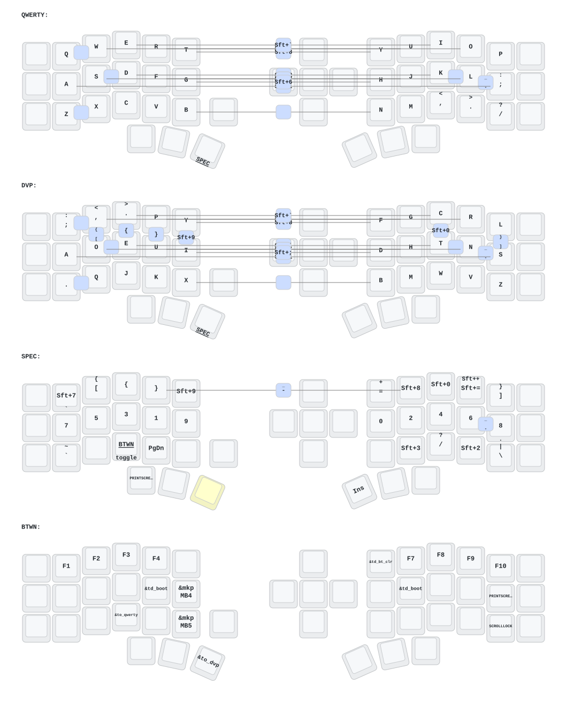

- [中文](README.md)
- [English](README_EN.md)

# 睫毛外设 (Eyelash Peripherals) Corne ZMK 仓库

**该键盘与 [foostan's Corne](https://github.com/foostan/crkbd) 不同，无法与标准的 `corne` 固件兼容。**


如果您需要该键盘的 3D 模型，请发送电子邮件至 `380465425@qq.com`。

## 使用说明

1. [叉取此仓库](https://docs.github.com/en/get-started/quickstart/fork-a-repo#forking-a-repository)。
2. [点击 **Actions** 选项卡，确保工作流已启用](https://docs.github.com/en/actions/managing-workflow-runs-and-deployments/managing-workflow-runs/disabling-and-enabling-a-workflow#enabling-a-workflow)。
3. 确保 [`config/west.yml`](config/west.yml) 中的 `eyelash_corne` 项目仍然有效。`boards/arm/eyelash_corne` 文件夹将从此 URL 下载。
4. 如果您的叉取中仍存在 `boards/arm/eyelash_corne` 文件夹，请将其删除。

**如果您已经有 ZMK 配置仓库，[您可以将此作为模块添加，而不是叉取](https://zmk.dev/docs/features/modules#building-with-modules)。**

## Corne 键位图



## My setup

### Layers

- **Layer 0 (EN)** — Dvorak Programmer, used with the ABC input source. The default layer, so a reset or a wake from deep sleep lands here.
- **Layer 1 (RU)** — *the same DVP letters*, used with the Russian DVP input source
- **Layer 2 (SPEC)** — numbers and symbols, accessed via `LT(2)` on the left inner thumb
- **Layer 3 (BTWN)** — F-keys, mouse, bluetooth, bootloader, accessed via `TO(3)` from SPEC layer

Layers 0 and 1 are letter-for-letter identical, and `scripts/gen-layouts.py`
refuses to generate a host layout if they ever drift apart. The mode exists for
one reason: `,` `?` `:` and `"` are typed with combos, and each needs a
*different scan code* depending on which layout the host has active. There is no
single binding that gives `,` in both — US puts it on `AB08`, and in Russian
that key has to be `ц`. So the keyboard keeps a language flag, but a stale flag
costs those four combos, never the alphabet.

### Input source switching

ZMK macros send `Hyper+1` (Ctrl+Shift+Alt+Cmd+1) and `Hyper+2` (Ctrl+Shift+Alt+Cmd+2) when switching mode. The host OS intercepts these and sets the input source **idempotently** (not toggle).

#### macOS

Copy `layouts/Russian DVP.keylayout` into `~/Library/Keyboard Layouts/`, then
add it under **System Settings → Keyboard → Input Sources → Others**. Its ⌘ and
⌃ maps emit plain US characters, so every shortcut stays on the physical key it
has in ABC.

Install [Hammerspoon](https://www.hammerspoon.org/) (`brew install --cask hammerspoon`) and add to `~/.hammerspoon/init.lua`:

```lua
require("hs.ipc")

local hyper = {"cmd", "alt", "ctrl", "shift"}

hs.hotkey.bind(hyper, "1", function()
    hs.keycodes.setLayout("ABC")
end)

hs.hotkey.bind(hyper, "2", function()
    hs.keycodes.setLayout("Russian DVP")
end)
```

Not `"Russian – PC"`: that is the stock layout drawn for QWERTY positions, and
the firmware no longer has a QWERTY layer to match it with.

#### Linux (GNOME)

On GNOME (especially Wayland + IBus) the *idempotent* approach used on macOS is
not possible: external writes to the active layout — `gsettings set
org.gnome.desktop.input-sources current N` and `ibus engine <name>` — are
silently ignored for actual input, and GNOME Shell exposes no D-Bus method to
select a source (`Eval` is disabled). The **only** thing that changes what you
type is GNOME Shell's own `switch-input-source` action, so the ZMK chords are
bound directly to that.

First enable the two layouts in GNOME (any order):

```sh
gsettings set org.gnome.desktop.input-sources sources "[('xkb', 'us'), ('xkb', 'ru')]"
```

Then run:

```bash
./scripts/linux-setup.sh
```

This adds `Hyper+1`/`Hyper+2` to `org.gnome.desktop.wm.keybindings`
`switch-input-source` / `switch-input-source-backward`.

**Caveat:** unlike macOS this is a **toggle**, not idempotent. With exactly two
sources it stays correct as long as the keyboard drives the switches; if they
desync (after login, or after switching via `Super+Space` or the top-bar
indicator), one extra switch re-syncs. For fully idempotent switching you'd need
a small GNOME Shell extension exposing a "select source N" D-Bus method — there
is one on the `custom-ru-dvp-layout` branch, not merged here yet.

### Russian on the DVP positions

HID carries scancodes, not characters, so one of the two alphabets always has to
come from the host — there is no usage code for «й». The *arrangement* does not:
[`scripts/gen-layouts.py`](scripts/gen-layouts.py) generates the stock Russian
layout permuted so that every Cyrillic letter lands on the same physical key it
has always occupied, while the firmware types DVP in both modes.

```bash
python3 scripts/gen-layouts.py   # regenerate after retuning the letters
./scripts/install-ru-dvp.sh      # Linux; prints how to verify and roll back
```

The permutation is read out of `config/eyelash_corne.keymap`, so retuning the
letters and re-running the generator keeps the two in step. The QWERTY reference
it permutes against is a constant in the script — it describes the keyboard
`ru` was drawn for, not this one.

In Russian the letters are exactly where they are on any ЙЦУКЕН board:

```
                left half                        right half
top      ;    ,    .    P    Y            F    G    C    R    L
         й    ц    у    к    е            н    г    ш    щ    з

home     A    O    E    U    I            D    H    T    N    S
         ф    ы    в    а    п            р    о    л    д    ж

bottom   '    Q    J    K    X            B    M    W    V    Z
         я    ч    с    м    и            т    ь    б    ю    . ,
```

#### What shifts

`х`, `ъ`, `ё` and `\` are inherited from stock `ru` untouched, so they stay
reachable from the symbol layer exactly as before. Two symbol-layer keys move,
because they sit on keys the permutation touches: in Russian the SPEC
apostrophe (hold on position 26) now gives `я` instead of `э`, and SPEC `/`
gives `э` instead of `.`. Both already produced the wrong character under stock
`ru`; `э` simply moved from the first key to the second.

The bracket combos stay English-only, so `х`/`ъ` still come from SPEC. Making
them `layers = <0 1>` would put `х ъ Х Ъ` on the home row in Russian too.

### Display

Uses a custom nice!view shield (`boards/shields/nice_view_custom/`) based on [nice-view-mod](https://github.com/GPeye/nice-view-mod). The right half (peripheral) shows Go Gopher + GNU Emacs logo. The left half (central) shows the standard status screen (layer, battery, BT profile, WPM).

#### Changing the display art

The nice!view is a 160x68 monochrome display mounted vertically. Images are stored as 140x68 LVGL arrays — the display driver handles rotation.

To replace the art:

1. Prepare your image in **portrait** orientation (68x140 px, black & white PNG)
2. Rotate it **90° clockwise** → you get a 140x68 landscape image
3. Convert to LVGL 1-bit indexed C array (ZMK v0.3 uses LVGL v8, format `LV_IMG_CF_INDEXED_1BIT`)
4. Replace `boards/shields/nice_view_custom/widgets/art.c`

Example using Python (requires Pillow):

```python
from PIL import Image

# 1. Load your portrait image (68x140)
img = Image.open("my_art_portrait.png").convert("1")

# 2. Rotate CW for the display driver
img = img.rotate(-90, expand=True)  # now 140x68

# 3. Convert to C array
W, H = img.size
bytes_per_row = (W + 7) // 8
pixel_data = []
for y in range(H):
    for byte_idx in range(bytes_per_row):
        byte_val = 0
        for bit in range(8):
            x = byte_idx * 8 + bit
            if x < W and img.getpixel((x, y)):
                byte_val |= (1 << (7 - bit))
        pixel_data.append(byte_val)

# 4. Write art.c (see existing file for full template with palette + lv_img_dsc_t)
```

The palette in `art.c` controls colors. Swap the two palette entries to invert black/white on the display.

### Flashing

Enter bootloader from layer 3 (BTWN): top-left key (left half) or top-right key (right half). Each half must be flashed separately.

### ZMK version

Pinned to `v0.3.0` in `config/west.yml` and `.github/workflows/build.yml`. The `main` branch requires Zephyr 4.1 HWMv2 migration which the eyelash_corne board doesn't support yet.