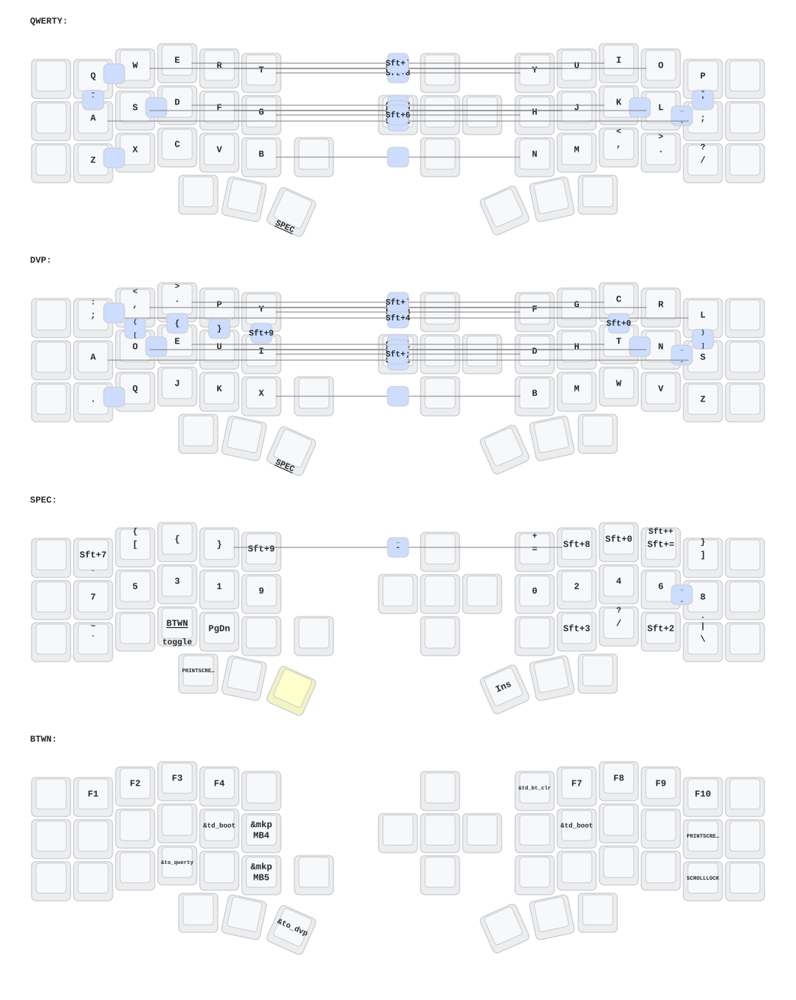

- [中文](README.md)
- [English](README_EN.md)

# 睫毛外设 (Eyelash Peripherals) Corne ZMK 仓库

**该键盘与 [foostan's Corne](https://github.com/foostan/crkbd) 不同，无法与标准的 `corne` 固件兼容。**


如果您需要该键盘的 3D 模型，请发送电子邮件至 `380465425@qq.com`。

## 使用说明

1. [叉取此仓库](https://docs.github.com/en/get-started/quickstart/fork-a-repo#forking-a-repository)。
2. [点击 **Actions** 选项卡，确保工作流已启用](https://docs.github.com/en/actions/managing-workflow-runs-and-deployments/managing-workflow-runs/disabling-and-enabling-a-workflow#enabling-a-workflow)。
3. 确保 [`config/west.yml`](config/west.yml) 中的 `eyelash_corne` 项目仍然有效。`boards/arm/eyelash_corne` 文件夹将从此 URL 下载。
4. 如果您的叉取中仍存在 `boards/arm/eyelash_corne` 文件夹，请将其删除。

**如果您已经有 ZMK 配置仓库，[您可以将此作为模块添加，而不是叉取](https://zmk.dev/docs/features/modules#building-with-modules)。**

## Corne 键位图



## My setup

### Layers

- **Layer 0 (QWERTY)** — used with macOS Russian input source
- **Layer 1 (DVP)** — Dvorak Programmer, used with macOS ABC input source
- **Layer 2 (SPEC)** — numbers and symbols, accessed via `MO(2)`
- **Layer 3 (BTWN)** — F-keys, mouse, bluetooth, bootloader, accessed via `TO(3)` from SPEC layer

Both outer columns are blank (`&none`). What used to live there — Tab, the sticky
shifts, Ctrl, `'` and `/` — moved onto combos and the symbol layer. The last
revision that still used the outer columns is kept under the tag `wide-cols`:

```sh
git switch -c wide wide-cols
```

### Input source switching

ZMK macros send `Hyper+1` (Ctrl+Shift+Alt+Cmd+1) and `Hyper+2` (Ctrl+Shift+Alt+Cmd+2) when switching layers. The host OS intercepts these and sets the input source **idempotently** (not toggle).

The `J + W` combo (both middle fingers, bottom row) switches to the other language. The long way still works: hold SPEC, tap `J` for BTWN, then `J` for Russian or `Esc` for English.

#### macOS

Install [Hammerspoon](https://www.hammerspoon.org/) (`brew install --cask hammerspoon`) and link its config from this repo:

```sh
ln -sf "$PWD/hammerspoon/init.lua" ~/.hammerspoon/init.lua
```

[`hammerspoon/init.lua`](hammerspoon/init.lua) sets the input source on `Hyper+1` / `Hyper+2` and reports every switch to Emacs (`my/klog-set-layout`, when Emacs defines it).

It also moves windows with `Ctrl+Alt+Shift` + the 5-way: `←` / `→` carries the focused window to the neighbouring Desktop (it goes once the keys are released), `↑` / `↓` to the monitor above or below. SPEC + the 5-way sends F16-F19 for the same four moves, with nothing to release. Without Shift the same keys move the focus: `←` / `→` cycle through the windows of the monitor, `↑` / `↓` go to the monitor above or below.

#### Linux (GNOME)

On GNOME (especially Wayland + IBus) the *idempotent* approach used on macOS is
not possible: external writes to the active layout — `gsettings set
org.gnome.desktop.input-sources current N` and `ibus engine <name>` — are
silently ignored for actual input, and GNOME Shell exposes no D-Bus method to
select a source (`Eval` is disabled). The **only** thing that changes what you
type is GNOME Shell's own `switch-input-source` action, so the ZMK chords are
bound directly to that.

First enable the two layouts in GNOME (any order):

```sh
gsettings set org.gnome.desktop.input-sources sources "[('xkb', 'us'), ('xkb', 'ru')]"
```

Then run:

```bash
./scripts/linux-setup.sh
```

This adds `Hyper+1`/`Hyper+2` to `org.gnome.desktop.wm.keybindings`
`switch-input-source` / `switch-input-source-backward`.

**Caveat:** unlike macOS this is a **toggle**, not idempotent. With exactly two
sources it stays correct as long as the keyboard drives the switches; if they
desync (after login, or after switching via `Super+Space` or the top-bar
indicator), one extra switch re-syncs. For fully idempotent switching you'd need
a small GNOME Shell extension exposing a "select source N" D-Bus method.

### Display

Uses a custom nice!view shield (`boards/shields/nice_view_custom/`) based on [nice-view-mod](https://github.com/GPeye/nice-view-mod). The right half (peripheral) shows Go Gopher + GNU Emacs logo. The left half (central) shows the standard status screen (layer, battery, BT profile, WPM).

Both halves also show the short sha of the commit the firmware was built from, so a flash can be checked against `git log`: under the layer name on the left, between the gopher and the Emacs logo on the right. It reads `unknown` if git was not available at build time. On the right it is drawn over columns 63–75 of the image in `widgets/art.c` (`SHA_BAND_X` in `widgets/peripheral_status.c`), so keep those empty when replacing the art.

#### Changing the display art

The nice!view is a 160x68 monochrome display mounted vertically. Images are stored as 140x68 LVGL arrays — the display driver handles rotation.

To replace the art:

1. Prepare your image in **portrait** orientation (68x140 px, black & white PNG)
2. Rotate it **90° clockwise** → you get a 140x68 landscape image
3. Convert to LVGL 1-bit indexed C array (ZMK v0.3 uses LVGL v8, format `LV_IMG_CF_INDEXED_1BIT`)
4. Replace `boards/shields/nice_view_custom/widgets/art.c`

Example using Python (requires Pillow):

```python
from PIL import Image

# 1. Load your portrait image (68x140)
img = Image.open("my_art_portrait.png").convert("1")

# 2. Rotate CW for the display driver
img = img.rotate(-90, expand=True)  # now 140x68

# 3. Convert to C array
W, H = img.size
bytes_per_row = (W + 7) // 8
pixel_data = []
for y in range(H):
    for byte_idx in range(bytes_per_row):
        byte_val = 0
        for bit in range(8):
            x = byte_idx * 8 + bit
            if x < W and img.getpixel((x, y)):
                byte_val |= (1 << (7 - bit))
        pixel_data.append(byte_val)

# 4. Write art.c (see existing file for full template with palette + lv_img_dsc_t)
```

The palette in `art.c` controls colors. Swap the two palette entries to invert black/white on the display.

### Flashing

Enter bootloader from layer 3 (BTWN): hold SPEC, tap `J`, then **double-tap** the home-row
index key of the half being flashed — `U` on the left half, `H` on the right. Keys are named
by what the DVP layer prints on them. Each half must be flashed separately, over its own USB
cable.

### kbdtr

[`kbdtr/`](kbdtr/) is the console for this keyboard: `kbdtr/kb` tells how to type a char,
prints the layers, measures typing by the Emacs keystroke log, and fetches and flashes the CI
builds; `kbdtr/kbdtr.el` shows the same in Emacs. See [`kbdtr/README.md`](kbdtr/README.md).

### ZMK version

Pinned to `v0.3.0` in `config/west.yml` and `.github/workflows/build.yml`. The `main` branch requires Zephyr 4.1 HWMv2 migration which the eyelash_corne board doesn't support yet.